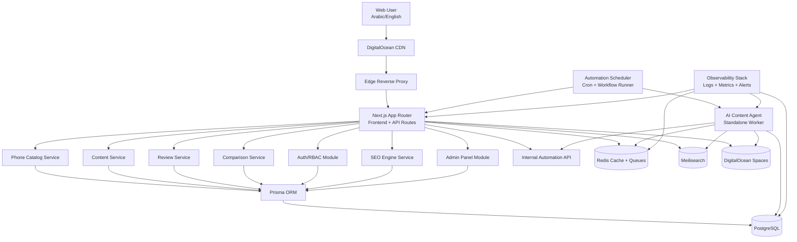

# Level 1 - System Architecture Blueprint

## Objective
Design the complete target architecture for a fully automated mobile-spec platform inspired by GSMArena, Mob4G, and MobileDokan using Next.js fullstack, Prisma, PostgreSQL, Redis, Meilisearch, DigitalOcean Spaces, and AI-driven content/SEO automation.

## High-Level Architecture

## Deployment Topology on DigitalOcean

1. **DigitalOcean Droplet / App Platform Node**
   - Runs `docker compose` stack.
   - Hosts web, worker, scheduler, reverse proxy, and observability agents.
2. **Managed PostgreSQL**
   - Primary relational datastore.
   - Point-in-time backups.
3. **Managed Redis**
   - Caching, queue buffering, job locks.
4. **Meilisearch Instance**
   - Full-text search, faceted filtering.
5. **DigitalOcean Spaces + CDN**
   - Phone images, article assets, Open Graph images, generated assets.

## Core Application Services

### 1) Web + API Service (`apps/web`)
- Next.js App Router UI (public site + admin dashboard).
- Route handlers for external API and internal automation API.
- SSR + ISR + edge caching strategy.

### 2) Worker Service (`apps/agent-worker`)
- Executes AI tasks: article/review generation, translation, schema generation, SEO optimization.
- Uses Redis-backed queues and retry policies.

### 3) Scheduler Service (`apps/scheduler`)
- Periodic workflows:
  - Phone feed updates.
  - SEO audits.
  - RSS ingestion.
  - Link checker.
  - weekly reports.

### 4) Search Indexer Service (`apps/indexer`)
- Syncs PostgreSQL changes to Meilisearch.
- Supports partial reindex + full rebuild.

### 5) Media Processor (`apps/media`)
- Validates uploaded images.
- Generates thumbnails and responsive variants.
- Pushes processed assets to Spaces.

## Request Flows

### Public Phone Page Flow
1. User requests `/phones/apple/iphone-15-pro`.
2. CDN serves cached result or forwards to app.
3. App fetches from Redis cache; falls back to PostgreSQL via Prisma.
4. App enriches with comparison snippets + review summary.
5. Response includes metadata, schema, hreflang tags.
6. CDN caches according to page policy.

### Admin Publish Flow
1. Admin creates phone/article via dashboard.
2. Validation + RBAC check.
3. Transactional write to PostgreSQL.
4. Queue jobs for:
   - translation,
   - SEO score,
   - schema generation,
   - search indexing,
   - cache invalidation.

### AI Agent Publishing Flow
1. Scheduler enqueues plan.
2. Agent drafts multilingual content.
3. SEO engine evaluates score and recommendations.
4. Agent auto-fixes until quality threshold.
5. Agent publishes via internal signed API.

## Security and Governance

- JWT session + rotating refresh strategy.
- RBAC roles: `super_admin`, `editor`, `reviewer`, `translator`, `support`, `automation_agent`, `user`.
- Internal API signed with HMAC + timestamp nonce.
- Rate limit public and internal endpoints.
- Audit logging for admin and agent actions.

## Performance Strategy

- Redis caching tiers:
  - object cache,
  - route cache,
  - aggregate cache.
- ISR for content-heavy pages.
- Meilisearch for fast filtered queries.
- Image optimization with WebP/AVIF derivatives.
- Selective hydration for interactive UI modules.

## Reliability Strategy

- Health checks for all services.
- Retry + dead-letter queues for background jobs.
- Circuit breaker for external AI provider calls.
- Automated service restart policy.
- Weekly backup verification and restore drill automation.

## Clean Architecture Mapping

- **Domain layer:** entities, value objects, domain services.
- **Application layer:** use cases and orchestration.
- **Infrastructure layer:** Prisma repos, Redis, Meilisearch, Spaces adapters.
- **Presentation layer:** Next.js pages/components/API handlers.

