# Level 1 - ERD (Entity Relationship Design)

## Core Entities

```mermaid
erDiagram
  USER ||--o{ SESSION : has
  USER ||--o{ REVIEW : writes
  USER ||--o{ COMMENT : writes
  USER ||--o{ ARTICLE : authors
  USER ||--o{ AUDIT_LOG : triggers
  USER ||--o{ API_KEY : owns

  ROLE ||--o{ USER_ROLE : maps
  USER ||--o{ USER_ROLE : maps

  BRAND ||--o{ PHONE_MODEL : has
  PHONE_MODEL ||--o{ PHONE_VERSION : has
  PHONE_MODEL ||--o{ PHONE_IMAGE : has
  PHONE_MODEL ||--o{ PHONE_SPEC_VALUE : has
  PHONE_MODEL ||--o{ REVIEW : receives
  PHONE_MODEL ||--o{ PRICE_SNAPSHOT : tracks

  SPEC_GROUP ||--o{ SPEC_DEFINITION : contains
  SPEC_DEFINITION ||--o{ PHONE_SPEC_VALUE : used_by

  PHONE_MODEL ||--o{ COMPARISON_ITEM : compares
  COMPARISON ||--o{ COMPARISON_ITEM : has

  CATEGORY ||--o{ ARTICLE : classifies
  ARTICLE ||--o{ ARTICLE_TRANSLATION : translates
  ARTICLE ||--o{ ARTICLE_TAG_MAP : tagged
  TAG ||--o{ ARTICLE_TAG_MAP : maps

  PHONE_MODEL ||--o{ PHONE_TRANSLATION : translates

  PAGE_SEO ||--o{ SEO_AUDIT : audited
  SEO_RULE ||--o{ SEO_AUDIT : applies

  AD_SLOT ||--o{ AD_CAMPAIGN : runs
  AFFILIATE_LINK ||--o{ CLICK_EVENT : tracks

  MEDIA_ASSET ||--o{ PHONE_IMAGE : reused_in
  MEDIA_ASSET ||--o{ ARTICLE : attached_to

  INTERNAL_JOB ||--o{ INTERNAL_JOB_LOG : logs
  INTERNAL_JOB ||--o{ INTERNAL_JOB_RESULT : produces
```

## Relational Breakdown

### Identity and Access
- `users`: account profile, locale preference, status.
- `roles`: system roles.
- `user_roles`: many-to-many user-role mapping.
- `sessions`: login/session state.
- `api_keys`: scoped internal keys for automation and integrations.

### Catalog
- `brands`: Apple, Samsung, Xiaomi, etc.
- `phone_models`: canonical phone entities.
- `phone_versions`: RAM/storage/regional variants.
- `phone_images`: ordered visual assets.
- `spec_groups`: Display, Battery, Performance, etc.
- `spec_definitions`: each measurable spec definition.
- `phone_spec_values`: value of a spec for a phone.
- `price_snapshots`: historical pricing.

### Comparison
- `comparisons`: saved comparison pages.
- `comparison_items`: included phones with order.

### Reviews and Community
- `reviews`: editorial + user reviews.
- `comments`: threaded comments for reviews/articles.

### Content System
- `categories`: news, reviews, guides.
- `articles`: primary content entries.
- `article_translations`: multilingual content versions.
- `tags`, `article_tag_map`: taxonomy.

### Translation Layer
- `phone_translations`: localized titles/descriptions/spec labels.

### SEO Intelligence
- `page_seo`: canonical metadata snapshots per page.
- `seo_rules`: scoring rules.
- `seo_audits`: periodic and event-triggered audit results.

### Monetization
- `ad_slots`: placements in UI.
- `ad_campaigns`: sponsored/ad campaigns.
- `affiliate_links`: trackable commerce links.
- `click_events`: affiliate + outbound tracking.

### Media and Storage
- `media_assets`: object metadata for Spaces/CDN files.

### Automation and Operations
- `internal_jobs`: queued automation jobs.
- `internal_job_logs`: execution logs.
- `internal_job_results`: output payload summaries.
- `audit_logs`: user + agent action history.

## Data Constraints Highlights

- Unique slug constraints for brands, phone models, articles.
- Composite uniqueness on `phone_spec_values(phone_model_id, spec_definition_id)`.
- Soft delete for content tables to protect referential history.
- Versioning for SEO metadata and translation outputs.
- Idempotency keys for internal jobs and ingestion.

