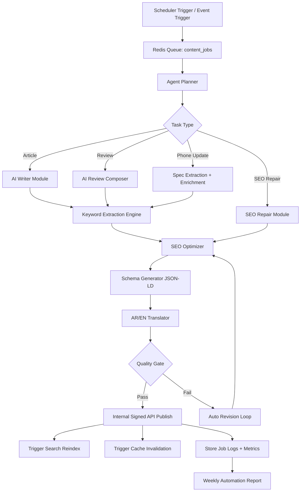

# Level 1 - AI Workflow Diagram and Logic

## Agent Objectives
The standalone AI Content Agent is responsible for automated content lifecycle management:
- Generate articles and reviews.
- Build bilingual content (Arabic and English).
- Improve SEO score.
- Generate structured data schemas.
- Publish through internal API.
- Monitor and repair SEO regressions.

## Workflow Diagram

## Core Modules

### 1) Planner Module
- Reads job payload and SLA priority.
- Selects strategy template:
  - breaking news,
  - long-form review,
  - comparison article,
  - spec patch.

### 2) Writer/Reviewer Module
- Uses structured prompt templates.
- Injects product facts from DB.
- Produces human-readable and scannable sections.

### 3) Keyword Engine
- Extracts primary, secondary, long-tail keywords.
- Measures keyword intent fit (informational vs transactional).

### 4) SEO Optimizer
- Checks title length, H1 uniqueness, heading hierarchy.
- Improves internal linking candidates.
- Improves semantic coverage and entity mentions.
- Ensures low keyword stuffing risk.

### 5) Schema Generator
- Generates JSON-LD:
  - `Product`
  - `Review`
  - `Article`
  - `FAQPage` when relevant.

### 6) Translation Module
- Bi-directional Arabic/English translation.
- Preserves technical terms and model names.
- Applies locale-aware formatting.

### 7) Quality Gate
- Threshold checks:
  - factual consistency,
  - readability,
  - SEO score target,
  - policy safety.
- Rejects and loops revision if below threshold.

### 8) Internal Publishing
- Uses signed request with idempotency key.
- Writes draft or publish state based on confidence.

## Feedback Loops

- SEO telemetry feeds next optimization pass.
- CTR and bounce-rate insights influence title rewrites.
- Search ranking changes trigger re-optimization jobs.

## Risk Controls

- Hard cap on autonomous publish volume per hour.
- Mandatory human-review mode for sponsored content.
- Source traceability for all generated factual claims.

