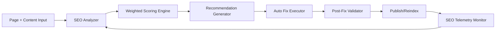

# Level 1 - SEO Engine Design

## Vision
Build a professional SEO engine that exceeds typical plugin-level systems by combining rule-based audits, semantic analysis, technical SEO checks, and autonomous remediation loops.

## SEO Engine Layers

## 1) Analyzer Layer

### Content SEO Checks
- Title length and keyword placement.
- Meta description quality and uniqueness.
- H1-H6 structure validity.
- Keyword distribution by section.
- Entity coverage for phone names, brands, and features.

### Technical SEO Checks
- Canonical URL validity.
- `hreflang` correctness for `ar` and `en`.
- Open Graph and Twitter cards completeness.
- Schema presence and syntax validity.
- Indexability directives.
- Core Web Vitals signals from telemetry.

### Internal Link Checks
- Contextual internal links present.
- Link anchor diversity.
- Orphan page detection.

## 2) Scoring Engine

- Composite score from 0-100.
- Weighted categories:
  - Content relevance: 30%
  - Technical health: 30%
  - Structured data quality: 15%
  - Internal linking: 15%
  - Performance metrics: 10%

### Score Bands
- 90-100: Excellent (auto-publish permitted).
- 75-89: Good (publish with minor suggestions).
- 60-74: Needs improvement (auto-fix + re-evaluate).
- <60: Block publish and escalate.

## 3) Recommendation Generator

Each recommendation includes:
- issue type,
- severity,
- exact location,
- suggested patch,
- expected score uplift.

## 4) Auto Fix Executor

- Rewrites title and description candidates.
- Injects missing schema blocks.
- Proposes internal links from related content graph.
- Optimizes heading hierarchy.

## 5) Validation Layer

- Re-runs full analyzer.
- Compares pre/post metrics.
- Writes SEO audit history.

## 6) Continuous Monitoring

### Automated Jobs
- Daily crawl of top pages.
- Weekly full-site audit.
- Event-triggered audits after content updates.

### Alerting
- Ranking drop anomalies.
- Traffic drop anomalies.
- Broken canonical/hreflang links.
- Schema invalidation alerts.

## 7) Data Model Inputs

- `page_seo`: snapshots per URL + locale.
- `seo_audits`: score and issue history.
- `seo_rules`: active scoring rules and weights.
- `internal_jobs`: queued SEO remediation tasks.

## 8) Arabic + English SEO Strategy

- Locale-specific keyword sets.
- Script-aware tokenization for Arabic.
- Independent scoring per locale page.
- Cross-locale consistency checks (intent parity).

## 9) Beyond Plugin-Level Differentiators

- Closed-loop auto-remediation.
- Measured impact tracking.
- AI-assisted semantic augmentation.
- Multi-locale entity graph optimization.
- Integration with content generation and publishing pipeline.

